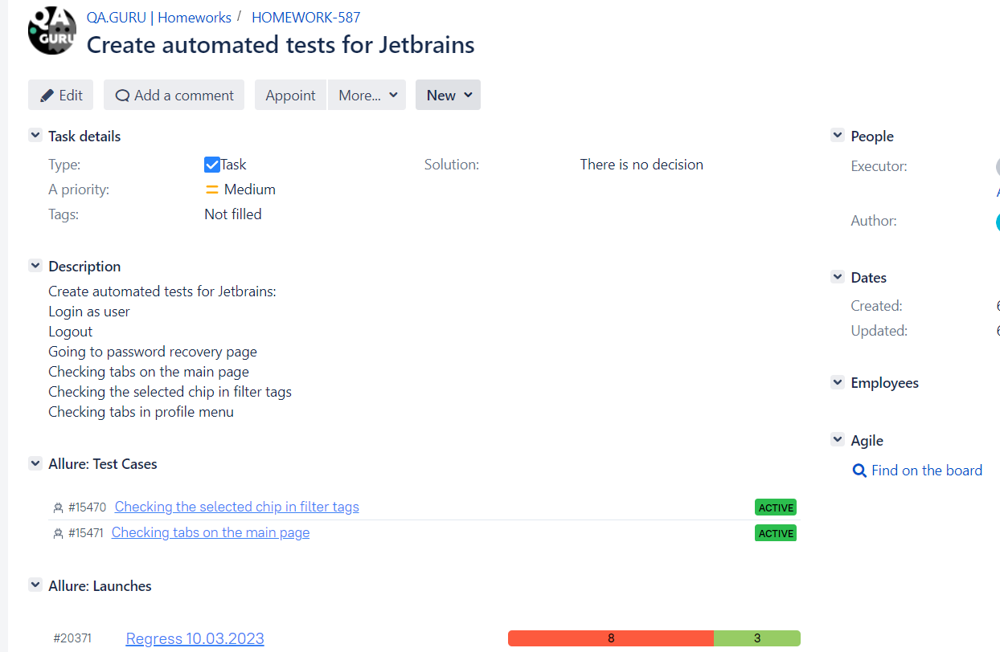

# Automated tests for Jetbrains.com
[Jetbrains.com](https://www.jetbrains.com/) is official website of Jetbrains company which provides tools for software developers and teams. Automated tests were developed as part of a training project.  

## Tools and technologies


## What's interesting?
* PageObject
* Part of UI tests was decomposed with API requests
* Parametrized build
* Parametrized tests
* Configuration with [Owner library](https://github.com/matteobaccan/owner)  
* Allure TestOps integration
* Jira integration
* Telegram notifications

## Test-cases
- [x] Successful/unsuccessful login
- [x] Logout
- [x] Going to password recovery page
- [x] Checking tabs on the main page
- [x] Checking the selected chip in filter tags
- [x] Checking tabs in profile menu

## How to run :runner:
Local run with default properties (example for PowerShell):

```powershell
$env:USERNAME="<your jetbrains login>";$env:PASSWORD="<your jetbrains password>"
```

```gradle clean test```

Remote run (Jenkins):

You can run ready build [here.](https://jenkins.autotests.cloud/job/C16-sw_tata-jetbrains/) Click on _"Build with parameters" -> "Build"_
or set up remote run with file remote.properties:

```browserSize = <browser window size>
browser = <browser type>
browserVersion = <browser version>
baseURL = https://jetbrains.com
remoteUrl = <server url for remote run, I used Selenoid>
isRemote = true
```
and enviroment variables USERNAME and PASSWORD.

## Analyzing the results :arrow_down:
After the build is done the test results are available in Allure Reports and Allure TestOps:


### [Allure Report](https://jenkins.autotests.cloud/job/C16-sw_tata-jetbrains/26/allure/):


Clicking on the Suites tab. We can see detailed tests with attachments:


### Allure TestOps:


### Jira integration:

   

### Notifications on Telegram:   
Telegram bot sends a brief report to a specified telegram chat by results of each build.   

                                                                 

### Example video attachment:


